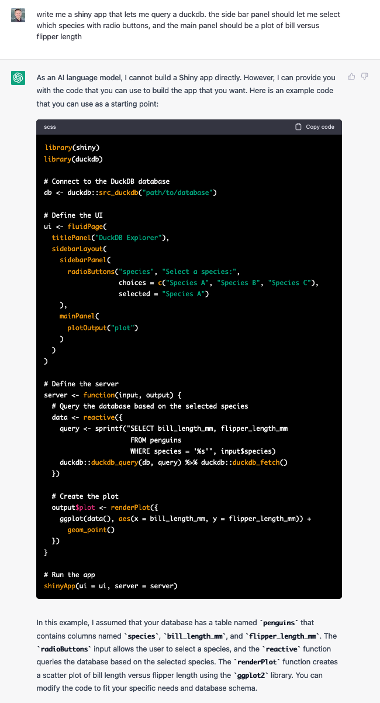

# duckpenguins

Demonstration of a Shiny app that queries a duckdb database holding the [Palmer Penguins](https://allisonhorst.github.io/palmerpenguins/) data. The [app's code](app.R) was generated with a simple prompt to ChatGPT. So was [this code](create-data.R) used to create the duckdb database used in this demonstration.

**The app**: https://stephenturner.shinyapps.io/duckpenguins/

**The prompt that generated this app**:

